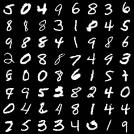
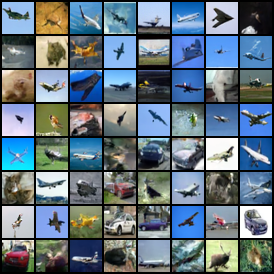
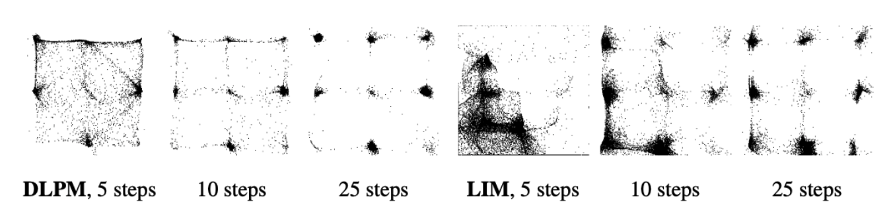

# ICLR25 | Denoising Lévy Probabilistic Models (DLPM)

[Arxiv paper](https://arxiv.org/abs/2407.18609)

Denoising Levy Probabilistic Models are heavy-tailed generative diffusion models, replacing the Gaussian distribution by the [Lévy stable distribution](https://en.wikipedia.org/wiki/Stable_distribution). This heavy-tailed modification improves the generation of heavy-tailed datasets, or (bounded) datasets exhibiting strong class imbalance (e.g., images with rare classes).

This repository contains the full implementation of DLPM, which consists in small modifications on top of an existing Gaussian-based diffusion model (DDPM) implementation.

## Repository Overview

This repo provides the tools for training, evaluation, and generation of data using these models. We are using [BEM (Better Experimentation Manager for deep learning with Pytorch)](https://github.com/darioShar/bem) to manage our experiments.

- **Generative Model Implementation**: Located in `dlpm/methods/dlpm.py` and `dlpm/methods/GenerativeLevyProcess.py`, these files contain the core logic of the DLPM generative model. Users interested in understanding or modifying the underlying generative processes should start here.
  
- **Neural Network Architecture**: If you want to change the neural networks used in the DLPM, head to the `dlpm/models` directory. This is where all the neural network models are defined and can be customized according to your needs.
  
- **Logging Configuration**: To customize how logging is handled, you can heritate from `bem/Logger.py` for integrating your own logger. An example of a custom logging setup is available in `dlpm/NeptuneLogger.py`.

- **Experiment Workflow**: The `dlpm/dlpm_experiment` file orchestrates the initialization of the training, evaluation, and data generation processes. To integrate your modifications into the experiment flow, update the `init` functions here. These functions will be provided to the `Experiment` class from the `bem` library.

- **Configuration Parameters**: Parameters for specific runs are passed in a dictionary called `p`, which is loaded from configuration files located in `dlpm/configs/`. Adjust these files to fine-tune the behavior of the model and experiment settings.

- **Comparison between discrete time DLPM and continuous time LIM**: This repository supports both DLPM, our discrete time heavy-tailed diffusion model, and LIM, the continuous time counterpart, as retrieved from the supplmentary material of the [corresponding LIM paper](https://openreview.net/forum?id=0Wp3VHX0Gm). While our paper argues for the superiority of the DLPM approach, users can experiment with both models and compare their behavior and performance.

## Supported Datasets

Here’s a brief overview of the supported datasets, as provided by `BEM`, and how to specify them:

- **2D Datasets**: 
  - The repository supports synthetic 2D datasets. See `Generator.available_distributions` in `bem/datasets/Data.py`.

- **Image Datasets**: 
  - You can use standard image datasets (MNIST, CIFAR-10, its long-tailed version CIFAR-10-LT, CELEBA etc.). See `bem/datasets/__init__.py`.

Configuration files for some of these datasets are provided in the `dlpm/configs/` directory: `mnist.yml` for MNIST, `cifar10.yml` for CIFAR-10, `cifar10_lt.yml` for CIFAR-10-LT.
    
You can modify the configuration files to adjust data loading settings, such as the batch size or data augmentation options, according to your experiment needs.

## Using the Provided Scripts

This repository includes scripts that simplify the process of training, evaluating, and visualizing the results of DLPM. Below is a description of each script and how to use them:

### 1. `run.py`

This script is used to train a model. It accepts various command-line arguments to control the training process, including configuration settings and experiment parameters.

**Example Command**:
```bash
python ./run.py --config mnist --name dlpm_test --method dlpm --epochs 100 --eval 50 --check 50 --train_reverse_steps 1000 
```

**Explanation**:
- `--config`: Specifies the configuration file to use (e.g., `mnist`).
- `--name`: The name of the experiment run, used for logging and identification. Here, the checkpointed models will be stored in `/models/dlpm_test/`.
- `--method`: Specifies the generative method to use (either `dlpm` or `lim`), in this case, `dlpm`.
- `--epochs`: The total number of training epochs.
- `--eval`: Specifies the interval (in epochs) for running evaluations during training.
- `--check`: Interval for model checkpointing (in epochs).
- `--train_reverse_steps`: The number of reverse steps to use during training.

### 2. `eval.py`

This script evaluates a pre-trained model and can also be used for generating samples from the trained model.

**Example Command**:
```bash
python ./eval.py --config mnist --name dlpm_test --method dlpm --epochs 100 --eval 100 --generate 2000 --reverse_steps 1000
```

**Explanation**:
- `--config`, `--name`, `--method`, and `--epochs`: Same as in `run.py`.
- `--eval`: Specifies the evaluation checkpoint to use.
- `--generate`: Number of samples to generate.
- `--reverse_steps`: Number of reverse steps to use during the generation process.

## Examples

Below, we showcase side-by-side comparisons of images generated by DLPM ($\alpha = 1.7$):

| MNIST (DLPM) | CIFAR10_LT (DLPM) |
|-------------|------------------|
|  |  |
---

And here is a comparison between DLPM and [LIM](https://openreview.net/forum?id=0Wp3VHX0Gm) across different numbers of reverse steps:




## Citation

```bibtex
@misc{shariatian2024denoisinglevyprobabilisticmodels,
      title={Denoising L\'evy Probabilistic Models}, 
      author={Dario Shariatian and Umut Simsekli and Alain Durmus},
      year={2024},
      eprint={2407.18609},
      archivePrefix={arXiv},
      primaryClass={cs.LG},
      url={https://arxiv.org/abs/2407.18609}, 
}
```

## Contribute

We welcome issues, pull requests and contributions. We will try our best to improve readability and answer questions.
